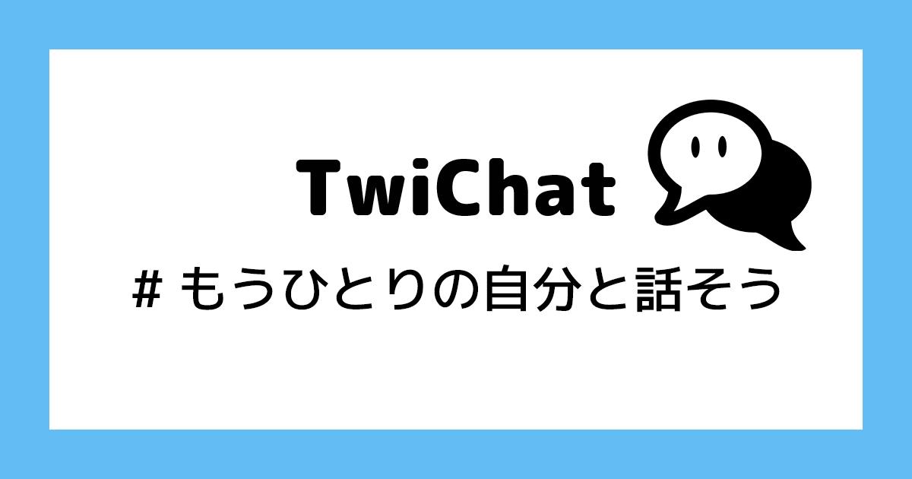

# TwiChat


## Setup

### Using Docker with Docker Compose
`docker-compose.yml`
```yml
version: '3.8'
services:

  nginx:
    container_name: nginx
    build:
      context: ./nginx
    environment:
      TZ: Asia/Tokyo
    ports:
      - 80:80
      - 443:443
    networks:
      - external_network
    depends_on:
      - web
      - backend

  web:
    container_name: web
    image: ghcr.io/iamtakagi/twichat_web
    build:
      context: ./web
    environment:
      TZ: Asia/Tokyo
    networks:
      - external_network
    depends_on:
      - backend

  postgres:
    container_name: postgres
    image: postgres
    environment:
      POSTGRES_USER: twichat
      POSTGRES_PASSWORD: twichat
      POSTGRES_DB: twichat
    restart: always
    volumes:
      - ./postgres:/docker-entrypoint-initdb.d
      - ./postgres/data:/var/lib/postgresql/data
    networks:
      - internal_network

  backend:
    container_name: backend
    image: ghcr.io/iamtakagi/twichat_backend
    build:
      context: ./backend
    volumes:
      - ./backend/log/gunicorn:/app/log/gunicorn
    environment:
      - POSTGRES_DB=twichat
      - POSTGRES_USER=twichat
      - POSTGRES_PASSWORD=twichat
      - POSTGRES_HOST=postgres
      - SECRET_KEY=secret
      - DEBUG=false
      - TWITTER_API_CONKEY=xxx
      - TWITTER_API_CONSEC=xxx
      - BACKEND_HOSTNAME=https://twichat.app
      - WEBPAGE_BASE_URL=http://twichat.app
    command: >
      /bin/bash -c "
      python manage.py migrate &&
      gunicorn -c /app/gunicorn.py twichat.wsgi"
    networks:
      - internal_network
      - external_network
    depends_on:
      - postgres

networks:
    external_network:
      external: true
    internal_network:
      internal: true
```

## Current Deployment
[@iamtakagi/cloud.iamtakagi.net](https://github.com/iamtakagi/cloud.iamtakagi.net)

## Products Available
Web: [https://twichat.app](https://twichat.app)\
Twitter: [@twichat_app](https://twitter.com/twichat_app)

## Product Owner
[@iamtakagi](https://github.com/iamtakagi)